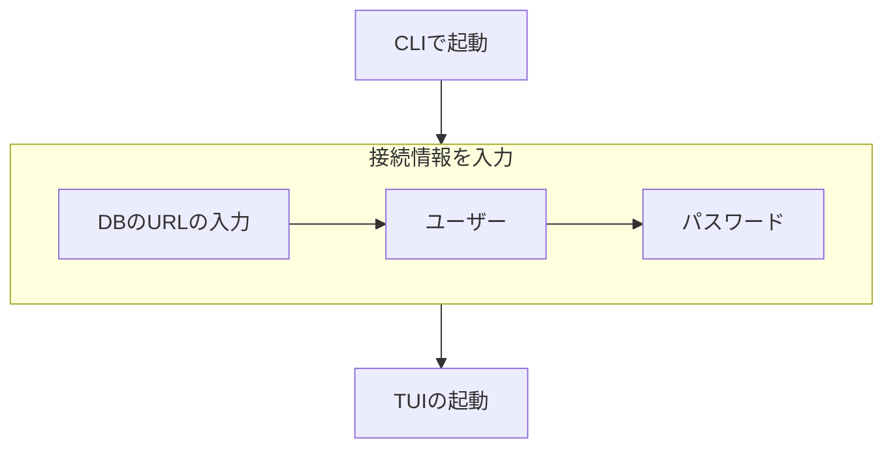

# 4. config-input-method

Date: 2026-08-29

## Status

Accepted

## Context

SQLクライアントを起動するにあたり、DBのURL、 ユーザー、 パスワードの接続情報が必要であるが、それをどのようにして入力するかが議論になった。

判断するにあたって、パスワードの入力があるため、その内容が露出しないように注意する必要があった。

## Decision

CLIで起動時に対話形式で入力するようにした。

### 他にあった選択肢

#### ファイルで渡す

configファイルを用意してそれを読み取る形式。

以下の理由で断念。
- ファイルを読めばパスワードが漏れる
- git管理している場合、commitしてしまうリスクがある

PostgreSQL公式は権限を絞ってパスワードファイルを管理するように推奨している。[PostgreSQL公式Doc](https://www.postgresql.org/docs/18/libpq-pgpass.html)

#### CLIの引数で渡す

CLIの引数で情報を入力する形式。

プロセスを見れば引数がわかってしまい、パスワードが露出してしまうため不採用。

MySQLでは現状可能だが、非推奨になっている。[MySQL公式Doc](https://dev.mysql.com/doc/refman/8.4/en/password-security-user.html)

#### 環境変数で渡す

環境変数で情報を渡す形式。

`echo`すれば見えてしまい、安全性が低いので不採用。

#### TUI上で入力

起動時にTUIを起動し、そこで入力。入力後はTUIが切り替わってSQLクライアントが起動する形式。

パスワードの露出リスクは低いが、MVPを考えた時に、TUIの描画・入力検知などの処理が必要になる。

また、TUIを切り替えるため、TUIにするメリットが薄いと考えた結果、不採用。

## Consequences

DBの接続情報の入力方法が決定し、CLI起動時に標準入力で入力する方法になった。

TUIほどリッチな描画はできないが、MVPに必要なSQLクライアントへDBの接続情報を渡すことが可能になる。
